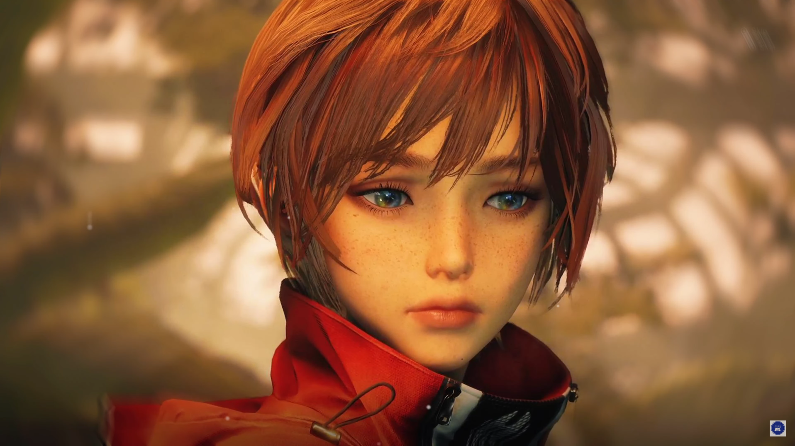

<!-- Header: Typograssy + Views -->
<div align="center">
  <a href="https://github.com/kawarimidoll/typograssy">
    
  </a>
  <p>
    
  </p>
</div>

<!-- Hero: GIF + Spotify (side-by-side, responsive) -->
<div style="display:flex;justify-content:center;align-items:center;gap:20px;margin-top:10px;flex-wrap:wrap;">
  
  
</div>

<!-- Discord presence -->
<div align="center" style="margin: 1.5rem 0;">
  <a href="https://discord.com/users/503306069884534796" rel="noreferrer">
    
  </a>
</div>

```csharp
mothersphere@github
─────────────────────────────
🌌 OS: SteamOS (Arch-based)
💻 Host: i.MX8 Embedded Linux
🧠 Kernel: 6.x (custom build)
🕓 Uptime: ∞ memories
📦 Packages: countless
🐚 Shell: bash
🖥️  Resolution: 1920x1080 (EGLFS)
🎨 WM: none (pure soul)
🧩 Terminal: Markdown
⚙️  CPU: Human Cortex (∞ Threads)
🎮 GPU: Imagination + Passion
💾 Memory: endless nostalgia

💫 Personal Info
─────────────────────────────
👤 Name: mothersphere
🌍 Origin: the digital void
💬 Languages: Python, C++, Bash
🧑‍💻 Occupation: Embedded Linux developer
🔧 Focus: PyQt5 • MQTT • TLS • i.MX8 optimization
🎧 Currently: Listening to stellar beats
🪐 Hobby: Building, dreaming, feeling
🎮 Favorite Game: Stellar Blade
🌐 Website: https://github.com/mothersphere
🖋️ Motto: “Precision. Purpose. Poetry.”
💭 Quote: "May your memories live on, forever."
🔮 Aesthetic: Cosmic minimalism
📫 Contact: mothersphere@digitalrealm.dev
🕯️ Mood: Tranquil yet infinite
``` |
|---|---|
```
<!-- Music Picks -->

<br>
<br>
<br>
<br>
<p align="right" style="clear: both;">
    <a href = "https://youtu.be/4biZQR2ov0s">
        
    </a>
    <b><br><br>🎵Lily's Atelier | Stellar Blade🎵</b>
</p>
<br>
<br>
<p align="left" style="clear: both;">
    <a href = "https://youtu.be/2L3OCqW76hE">
        
    </a>
    <b><br><br>🎶Dawn in The Adan | Ichiko Aoba🎶🆙</b>
</p>
<br>
<br>
<p align="right" style="clear: both;">
    <a href="https://youtu.be/AT5fDDKWMok">
        
    </a>
    <b><br>🎶17 Sekibetsu | GATE🎶💌</b>
</p>
<br>
<br>
<p align="left" style="clear: both;">
    <a href="https://youtu.be/zdIc3CHvmzo">
        
    </a>
    <b><br><br>💘Wu Yun Ta Na | Pulse 💕</b>
</p>
<br>
<br>
<p align="right" style="clear: both;">
    <a href = "https://youtu.be/4biZQR2ov0s">
        
    </a>
    <b><br><br>🎵Lily's Atelier | Stellar Blade🎵</b>
</p>
<br>
<br>
<p align="left" style="clear: both;">
    <a href = "https://youtu.be/2L3OCqW76hE">
        
    </a>
    <b><br><br>🎶Dawn in The Adan | Ichiko Aoba🎶🆙</b>
</p>
<br>
<br>
</div>

<br>
<br>
<br>


<h2 align="center">🔎 Knowledge 📖</h2>

- [x] Learning Python  
- [x] Creating a GUI for {insert project}  
- [ ] Learning Vim  
- [ ] Learning Lua  
- [ ] Learning bash/powershell  

<div align="center">
  <p style="max-width: 600px; text-align: justify; margin: 0 auto;">
    Behold! My skills:
  </p>
  <a href="https://skillicons.dev">
    
  </a>
</div>

<h2 align="center">📉 GitHub Stats</h2>

<div align="center">
  <a href="https://github-readme-stats.vercel.app">
    
  </a>
  <a href="https://github-readme-streak-stats.herokuapp.com">
    
  </a>
  <a href="https://github.com/ryo-ma/github-profile-trophy">
    
    
  </a>
  <a href="https://github.com/ashutosh00710/github-readme-activity-graph">
    
  </a>
  <a href="https://github.com/vn7n24fzkq/github-profile-summary-cards">
    
  </a>
</div>


<h2 align="center">📝 Contact Me 📝</h2>

<div align="center">
  <a href="https://github.com/mothersphere" rel="noreferrer">
    
  </a>
  <div style="margin: 1.5rem 0;">
    
  </div>
  <div style="margin: 1.5rem 0;">
    
  </div>
</div>

<div style="margin-top: 2rem;">
  <h2 align="center">Thank You for Reading 🙋🏻‍♂️</h2>
  <div align="center">
    
  </div>
</div>
  </div>
</div>
