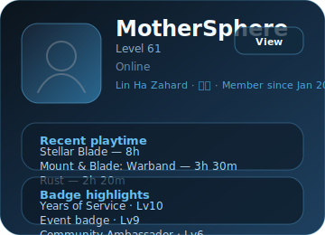

<div align="center">
  <a href="https://github.com/kawarimidoll/typograssy">
    
  </a>
  <p>
    
  </p>
</div>

<div align="center" style="margin: 1.5rem 0;">
  
</div>
<br>
<div
  align="center"
  style="margin: 1.5rem 0; display: flex; justify-content: center; gap: 1.5rem; flex-wrap: wrap;"
>
  <a href="https://discord.com/users/503306069884534796">
    
  </a>
  <br>
  <br>
  <!-- Steam showcase generated via scripts/update_steam_showcase.py -->
  <!-- Refresh with: python3 scripts/update_steam_showcase.py --vanity <steam-vanity> --cache data/steam-profile-cache.json -->
  <a href="https://steamcommunity.com/id/lopobia" style="text-decoration: none;">
    
  </a>
  <br>
  <br>
  <a href="https://github.com/kittinan/spotify-github-profile">
    
  </a>
</div>

<h2 align="center">👁️‍🗨️ About Me 👁️‍🗨️</h2>

```zsh
┌─[MotherSphere@Colony] - [~]
└─>[$] neofetch
```

<div align="center" style="margin: 2rem 0;">
  
</div>

<div>
    <br>
    <br>
    <br>
    <br>
    <p align="right" style="clear: both;">
        <a href = "https://youtu.be/4biZQR2ov0s">
            
        </a>
        <b><br><br>🎵Lily's Atelier | Stellar Blade🎵</b>
    </p>
    <br>
    <br>
    <p align="left" style="clear: both;">
        <a href = "https://youtu.be/2L3OCqW76hE">
            
        </a>
        <b><br><br>🎶Dawn in The Adan | Ichiko Aoba🎶🆙</b>
    </p>
    <br>
    <br>
    <p align="right" style="clear: both;">
        <a href="https://youtu.be/AT5fDDKWMok">
            
        </a>
        <b><br>🎶17 Sekibetsu | GATE🎶💌</b>
    </p>
    <br>
    <br>
    <p align="left" style="clear: both;">
        <a href="https://youtu.be/zdIc3CHvmzo">
            
        </a>
        <b><br><br>💘Wu Yun Ta Na | Pulse 💕</b>
    </p>
    <br>
    <br>
    <p align="right" style="clear: both;">
        <a href = "https://youtu.be/4biZQR2ov0s">
            
        </a>
        <b><br><br>🎵Lily's Atelier | Stellar Blade🎵</b>
    </p>
    <br>
    <br>
    <p align="left" style="clear: both;">
        <a href = "https://youtu.be/2L3OCqW76hE">
            
        </a>
        <b><br><br>🎶Dawn in The Adan | Ichiko Aoba🎶🆙</b>
    </p>
    <br>
    <br>
</div>

<br>
<br>
<br>


<h2 align="center">🔎 Knowledge 📖</h2>
<!-- ROADMAP -->

- [x] Learning Python
- [x] Creating a GUI for {insert project}
- [ ] Learning Vim
- [ ] Learning Lua
- [ ] Learning bash/powershell

<div align="center">
  <p style="max-width: 600px; text-align: justify;">
    Behold! My skills:
  </p>
  <a href="https://skillicons.dev">
    
  </a>
</div>

<h2 align="center">📉 GitHub Stats</h2>

<div align="center">
  <a href="https://github-readme-stats.vercel.app">
    
  </a>
  <a href="https://github-readme-streak-stats.herokuapp.com">
    
  </a>
  <a href="https://github.com/ryo-ma/github-profile-trophy">
    
    
  </a>
  <a href="https://github.com/ashutosh00710/github-readme-activity-graph">
    
  </a>
  <a href="https://github.com/vn7n24fzkq/github-profile-summary-cards">
    
  </a>
</div>

<h2 align="center">📝 Contact Me 📝</h2>

<div align="center">
  <a href="https://github.com/mothersphere" target="_blank">
    
  </a>
  <div style="margin: 1.5rem 0;">
    
  </div>
  <div style="margin: 1.5rem 0;">
    
  </div>
</div>

<div style="margin-top: 2rem;">
  <h2 align="center">Thank You for Reading 🙋🏻‍♂️</h2>
  <div align="center">
    
  </div>
</div>
